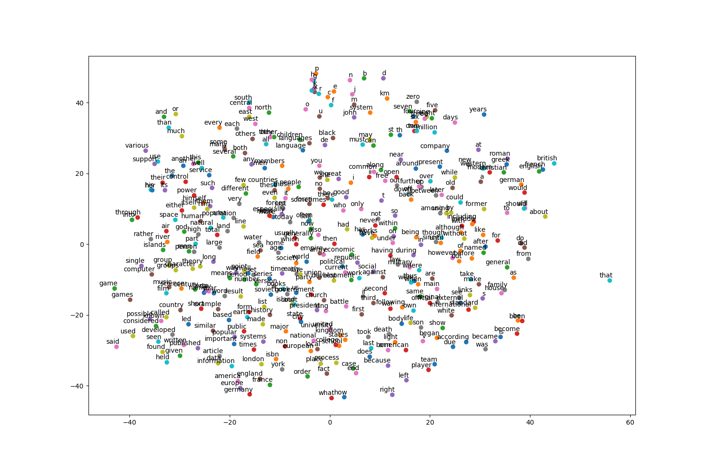

# word2vec_tensorflow
An implementation of word2vec (both CBOW and skip-gram) with tensorflow adapted from [udacity's intro to deep learning example code](https://github.com/tensorflow/tensorflow/blob/master/tensorflow/examples/udacity/5_word2vec.ipynb)

run
> python train.py

to see the result trained over [Text8](http://mattmahoney.net/dc/textdata) data

## Result with default param after 100,001 steps
### Skip-gram

Nearest to their: its, his, her, your, our, the, several, my   
Nearest to that: which, what, however, who, golovachev, imperfect, but, eesti   
Nearest to b: d, c, hafez, manager, katrina, ref, certificate, sage   
Nearest to three: four, five, two, seven, eight, six, nine, zero   
Nearest to called: named, used, referred, known, capua, vico, rouse, approximation   
Nearest to with: between, weymouth, salicylate, at, including, agreeable, fright, in   
Nearest to seven: eight, four, six, nine, five, three, zero, two   
Nearest to such: well, known, including, certain, these, regarded, many, follows   
Nearest to was: is, became, has, had, were, jn, been, valera   
Nearest to have: had, has, are, include, having, were, require, contain   
Nearest to often: sometimes, usually, generally, commonly, frequently, typically, now, still   
Nearest to new: schema, salmonella, benedictine, monograph, crushes, separate, princely, weizenbaum   
Nearest to war: pygmy, wars, connectionless, engaged, mitsuda, jerusalem, instincts, avril   
Nearest to only: geopolitics, least, bitchx, fig, nance, stjepan, sceptical, rcs   
Nearest to this: it, which, another, butterfield, the, he, there, some   
Nearest to four: seven, five, six, eight, three, two, nine, zero  

### CBOW result

Nearest to their: its, his, her, our, your, my, whose, discursive   
Nearest to that: which, however, what, musicbrainz, cubism, emanation, kilmer, rosenberg   
Nearest to b: d, te, cavalier, ares, twitching, blended, drank, sf   
Nearest to three: five, four, six, seven, eight, two, nine, zero   
Nearest to called: named, termed, considered, cited, jos, referred, known, used   
Nearest to with: between, xiaoping, toward, rc, via, handguard, recapitulation, using   
Nearest to seven: eight, five, four, six, nine, three, zero, two   
Nearest to such: these, filesystems, certain, well, mentioned, geschichte, guderian, known   
Nearest to was: is, became, were, had, has, lula, be, maintains   
Nearest to have: had, has, are, were, include, having, feel, already   
Nearest to often: usually, sometimes, frequently, commonly, typically, generally, normally, traditionally   
Nearest to new: fourth, esteem, strange, third, fusion, ludlow, deanna, master   
Nearest to war: buch, versailles, shrews, aas, apartheid, ruthenia, fao, passions   
Nearest to only: substantially, especially, either, autumnal, telegram, talked, until, alternatively   
Nearest to this: which, it, another, each, jacobitism, inquiries, what, the   
Nearest to four: six, five, seven, three, eight, nine, zero, two   
